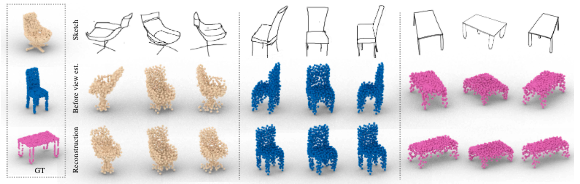
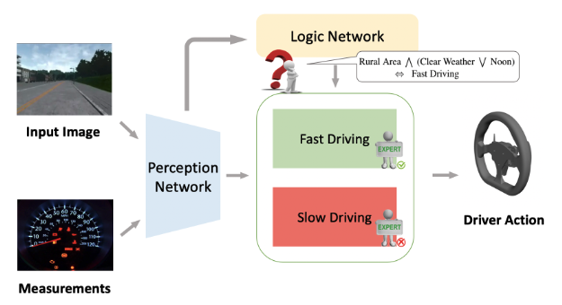

I'm a first-year Ph.D. student at UT Austin advised by Prof. [Philipp Krähenbühl](https://www.philkr.net/) and Prof. [Yuke Zhu](https://www.cs.utexas.edu/~yukez/). Before coming to Austin, I spent four wonderful years at UC Berkeley as an undergraduate and a researcher at [BAIR](https://bair.berkeley.edu/), advised by Prof. [Trevor Darrell](https://people.eecs.berkeley.edu/~trevor/) and Prof. [Jitendra Malik](https://people.eecs.berkeley.edu/~malik/).

My research lies at the intersection of vision, robotics and machine learning. I'm interested in learning meaningful visual representations through interaction and using such priors to faciliate down-stream tasks. I also work on building robust and generalizable learning algorithms that are applicable in the real world.

News
======
 
* Our recent paper ***Fighting Copycat Agents in Behavioral Cloning from Multiple Observations*** is accepted to NeurIPS 2020. Paper and code will be public soon!

* I graduated from UC Berkeley with Highest Honors in Applied Mathematics, Honors in Computer Science and Highest Distinction in General Scholarship.

Projects
======

## Fighting Copycat Agents in Behavioral Cloning from Multiple Observations 
Chuan Wen\*, **Jierui Lin**\*, Trevor Darrell, Dinesh Jayaraman, Yang Gao   
NeurIPS 2020

***Copycat problem*** in an autonomous driving scenario: The vehicle waits at the red light and start to drive when the light turns green. A ***copycat*** policy which simply replays its previous action will predict all but one actions correctly while being useless when evaluated in the environment. 

To combat this ***copycat problem***, we propose an adversarial approach to learn a feature representation that removes excess information about the previous expert action nuisance correlate, while retaining the information necessary to predict the next action. In our experiments, our approach improves performance significantly across a variety of partially observed imitation learning tasks.

## 3D Shape Reconstruction from Free-Hand Sketches
Jiayun Wang, **Jierui Lin**, Qian Yu, Runtao Liu, Yubei Chen, Stella X. Yu

	

Sketches are the most abstract 2D representations of real-world objects. Although a sketch usually has geometrical distortion and lacks visual cues, humans can effortlessly envision a 3D object from it. 

We pioneer to study this task and aim to enhance the power of sketches in 3D-related applications such as interactive design and VR/AR games. Further, we propose a novel sketch-based 3D reconstruction framework (shown above). Extensive experiments demonstrate the effectiveness of our model and its strong generalizability to various free-hand sketches.

## Learning a Perception-Logic Network for Unsupervised Scene Conditioned Driving Behavior
**Jierui Lin**\*, Yifei Xing\*, Huazhe Xu, Trevor Darrell, Yang Gao   

	

Human driving behavior can not be explained solely by traffic rules, rather, people take a lot of ***scene factors*** into account. Autonomous driving system should obtain those behaviors as well, since it not only ensures natural interactions with non-autonomous divers and pedestrians, but also improves driving safeness. 

We propose to leverage only demonstrative driving data to unsupervisely learn those scene factors and combine the learned scene factors with a logic network, to finally output the driving behaviors. 
Our experiments show that the proposed ***Perception-Logic*** network can unsupervisely learn meaningful scene factors and generalize almost perfectly in terms of scene conditioned behavior. The driving performance is significantly better than strong state-of-the-art baselines.
